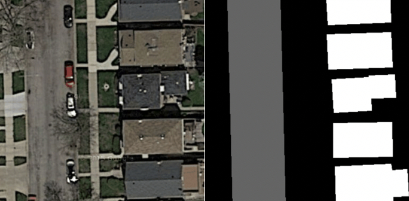
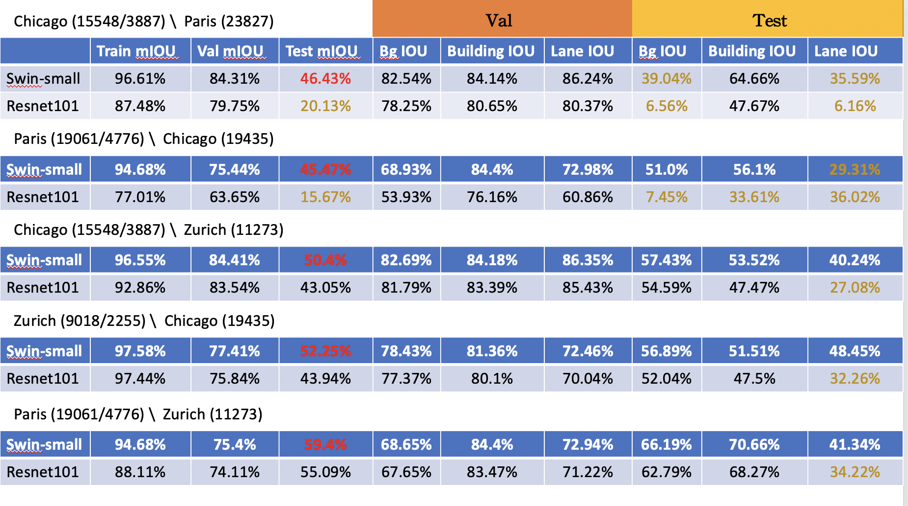
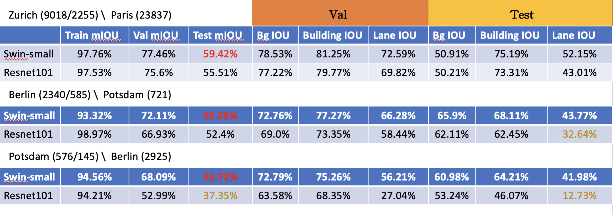
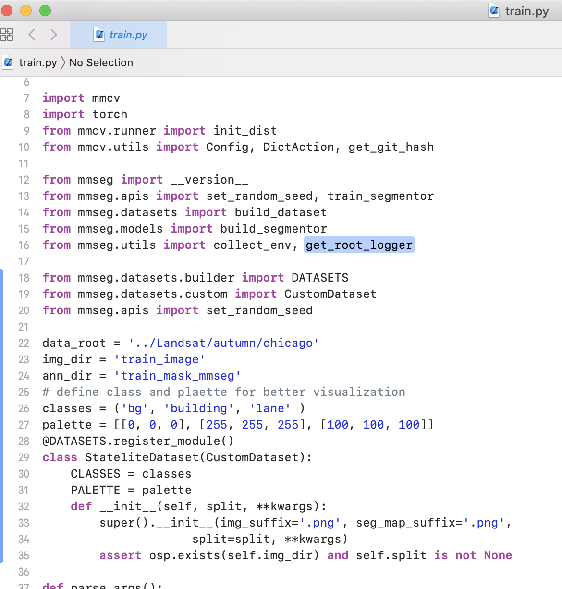
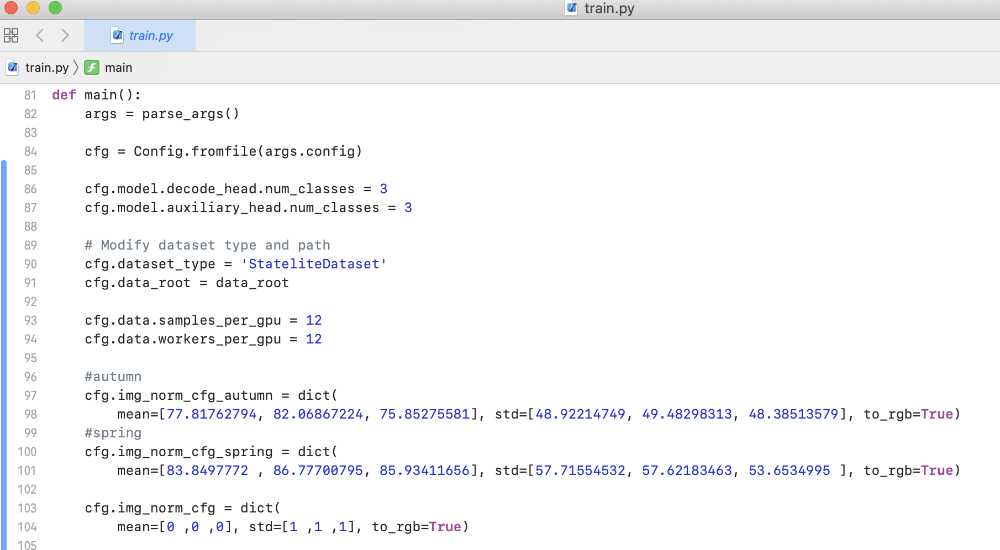
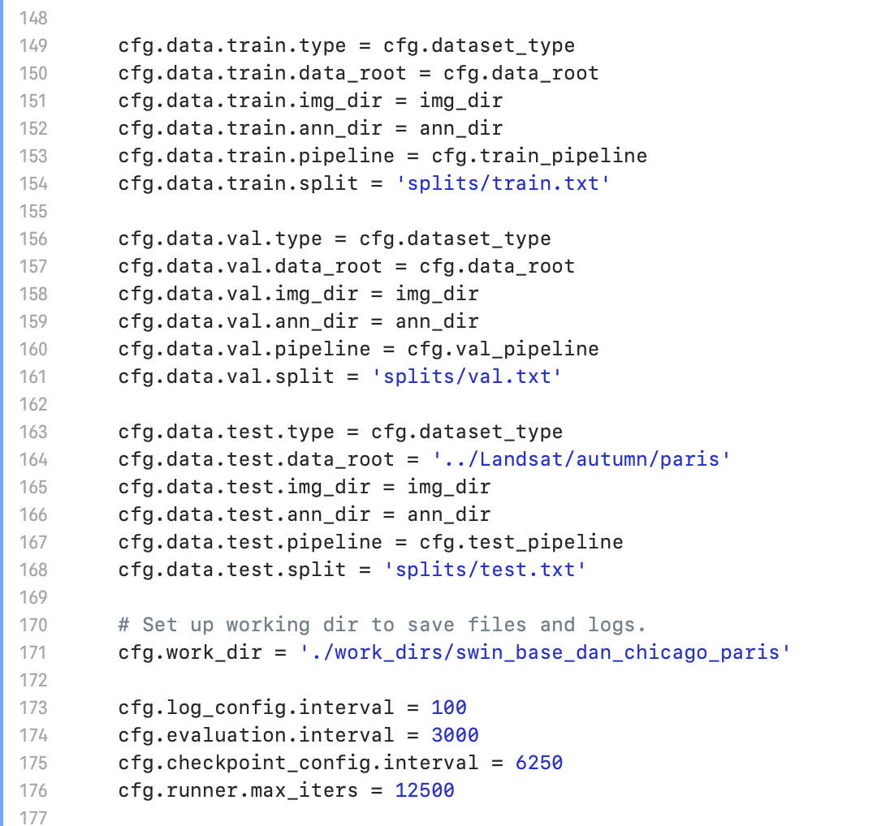

# Swin Transformer add EncNet \ DaNet \ DraNet for semantic segmentation on Statelite Dataset

This repo contains the supported code and configuration files to reproduce semantic segmentaion results of [Swin Transformer](https://arxiv.org/pdf/2103.14030.pdf). It is based on [mmsegmentaion](https://github.com/open-mmlab/mmsegmentation/tree/v0.11.0).

This repo contains that I used DaNet \ EncNet \ DraNet to add behind the backbone of swin-transformer and do experiments on the satellite dataset.
The purpose of the experiment is to see whether training Transformer in (different country, different seasons) or (same season, different countries) is better than CNN generalization ability?


## Data, My Data pre-processing, My model setting

### Data

 [CITY-OSM ](https://zenodo.org/record/1154821#.YVFomtMzYUr) 
 This dataset contains satellite data of six countries, and there are three categories to be classified. Background, buildings and roads
 
 
 ### My Data pre-processing
 
 1. Data size: 384*384
 2. The data has brightness, saturation, and contrast adjustments during training
 3. Data is Normalized before feed into model

 ### My model setting

1. Model: (Swin-small\base) + Upernet \ Resnet101 + Upernet
2. Batch training size: 8
3. Training round: 120000 iterations (1 iteration is 1 batch size)
4. Computer equipment: A100 or 1080Ti

**Notes**: 

- **Swin Pre-trained models can be downloaded from [Swin Transformer for ImageNet Classification](https://github.com/microsoft/Swin-Transformer)**.

## Results and Models




## Usage
You need to modify the train.py file in the tools. 
1. Import the data you want
As shown in the figure:


2. Predicted category and batch size
As shown in the figure:


2. Import training, validation, and test txt and modify training rounds
As shown in the figure:


## Training
e.g. 
Train Swin-small + Dran
```
tools/dist_train.sh configs/swin/dranet_swin_small_patch4_window7.py 1 --options  model.pretrained=./swin_weights/swin_small_patch4_window7_224.pth
```

## Testing
e.g.
Test Swin-small + Dran
```
tools/dist_test.sh work_dirs/swin_dran_chicago_paris/dranet_swin_small_patch4_window7.py work_dirs/swin_dran_chicago_paris/iter_12500.pth \
    1 --eval mIoU --eval-options efficient_test=True
```

You can see more training code on dran_dan_encnet_train_script.txt


## Cite
```
@article{liu2021Swin,
  title={Swin Transformer: Hierarchical Vision Transformer using Shifted Windows},
  author={Liu, Ze and Lin, Yutong and Cao, Yue and Hu, Han and Wei, Yixuan and Zhang, Zheng and Lin, Stephen and Guo, Baining},
  journal={arXiv preprint arXiv:2103.14030},
  year={2021}
}
```

```
@article{fu2020scene,
  title={Scene Segmentation With Dual Relation-Aware Attention Network},
  author={Fu, Jun and Liu, Jing and Jiang, Jie and Li, Yong and Bao, Yongjun and Lu, Hanqing},
  journal={IEEE Transactions on Neural Networks and Learning Systems},
  year={2020},
  publisher={IEEE}
}
```

```
@inproceedings{fu2019dual,
  title={Dual attention network for scene segmentation},
  author={Fu, Jun and Liu, Jing and Tian, Haijie and Li, Yong and Bao, Yongjun and Fang, Zhiwei and Lu, Hanqing},
  booktitle={Proceedings of the IEEE Conference on Computer Vision and Pattern Recognition},
  pages={3146--3154},
  year={2019}
}
```


If you have any questions, you are welcome to ask ;)


